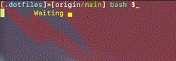

# My dotfiles OSX/Linux

## Prerequisite(s)
* Install Apple's CLI tools.
```
 xcode-select --install
``` 
* ...

## Visual(s)


## TODO(s)

* Linux [ apt, brew, ??? ]
* Complete write up for [`setup.sh`](./setup.sh)
* ...
